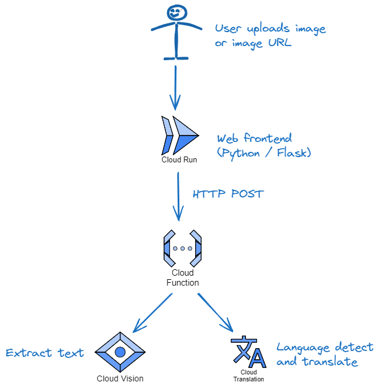

# Image Text Extract and Translation

## Example Use Case

- A user wants to translate a meme in Ukrainian, to English.

## Application Overview

A simple application that:

- Allows a user to upload or paste an image.
- The image is processed, probably using Google Vision API. Any text is extracted.
- The text is translated (if necessary) using Google Cloud Translation API.

## Architecture



- Frontend:
  - In Python and containerised.
  - Hosted in Cloud Run.
- Backend:
  - A Google Cloud Function, in Python.

## Function Design

Two ways to call the function:

1. POST the image. E.g. 
   curl -X POST localhost:8080 -H "Content-Type: multipart/form-data" \
   -F "uploaded=@/home/path/to/meme.jpg"
1. Reference a bucket and filename. E.g.
   curl -X GET localhost:8080 -H "Content-Type: application/json" \
     -d '{"bucket":"Bob", "filename":"meme.jpg"}'

## For Local Dev

```bash
# Cloud CLI installed in local Linux environment.
# Create and activate Python env

# set up envs
export PROJECT_ID=$(gcloud config list --format='value(core.project)')

# set default credentials for making API calls from local dev environment
gcloud auth application-default login

# allow local Cloud Functions dev using the framework
pip install functions-framework

# install Google Cloud SDKs and other requirements (in appropriate folder)
pip install -r requirements.txt

# run the function
functions-framework --target extract_and_translate --debug

# test, from another console, e.g.
curl -X POST localhost:8080 -H "Content-Type: multipart/form-data" \
   -F "uploaded=@/home/path/to/meme.jpg"
```

## Deploying the Function with Gcloud

```bash
gcloud functions deploy extract-and-translate \
  --gen2 \
  --region europe-west2
  --runtime=python312 \
  --source=. \
  --trigger-http --entry-point=extract_and_translate
```