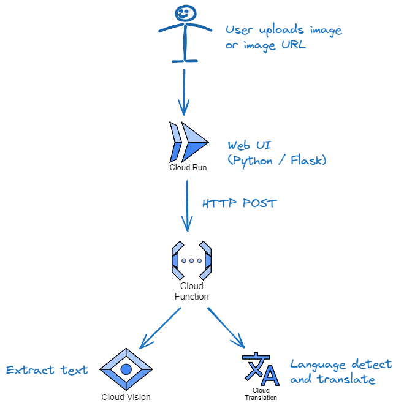

# Image Text Extract and Translation

## Overview

An application that allows a user to upload an image containing text. The text will be extracted, and translated as required. The translated text is returned.

This will make use of Google Cloud serverless components, and Google ML APIs.

### How It Works

1. A user uploads or pastes an image.
1. The image is processed, using Google Vision API. Any text is extracted.
1. The text is translated (if necessary) using Google Cloud Translation API.

### Example Use Case

- A user wants to translate a meme in Ukrainian, to English.

## Repo Structure

```text
└── image-text-translator
    ├── docs/
    |
    ├── infra-tf/               - Terraform for installing infra
    |
    ├── scripts/                - For environment setup and helper scripts
    |   └── setup.sh            - Setup helper script
    |
    ├── app/                    - The Application
    │   ├── ui_cr/                - Browser UI (Cloud Run)
    │   │   ├── static/             - Static content for frontend
    |   |   ├── templates/          - HTML templates for frontend
    |   |   ├── app.py              - The Flask application
    |   |   ├── requirements.txt    - The UI Python requirements
    |   |   ├── Dockerfile          - Dockerfile to build the Flask container
    |   |   └── .dockerignore       - Files to ignore in Dockerfile
    |   |
    │   └── backend_gcf/          - Backend (Cloud Function)
    │       ├── main.py             - The backend CF application
    │       └── requirements.txt    - The backend CF Python requirements
    |
    ├── testing/
    │   └── images/
    |
    ├── requirements.txt          - Python requirements for project local dev
    └── README.md                 - Repo README
```

## Architecture



- UI:
  - Python Flask application, containerised.
  - Hosted in Cloud Run.
- Backend:
  - A Google Cloud Function, in Python.

## Setup

### Project Setup

- Create a Google Cloud project to host the application.
- Enable the necessary APIs.

```bash
# Authenticate to Google Cloud
gcloud auth list

# Check we have the correct project selected
export PROJECT_ID=<enter your project ID>
gcloud config set project $PROJECT_ID

# Enable necessary APIs
gcloud services enable cloudbuild.googleapis.com
gcloud services enable storage-api.googleapis.com
gcloud services enable artifactregistry.googleapis.com
gcloud services enable eventarc.googleapis.com
gcloud services enable run.googleapis.com
gcloud services enable logging.googleapis.com
gcloud services enable pubsub.googleapis.com
gcloud services enable cloudfunctions.googleapis.com
gcloud services enable translate.googleapis.com
gcloud services enable vision.googleapis.com
gcloud services enable iamcredentials.googleapis.com
```

- Setup service account and assign roles:

```bash
export SVC_ACCT=image-text-translator-sa
export SVC_ACCOUNT_EMAIL=$SVC_ACCT@$PROJECT_ID.iam.gserviceaccount.com

# Attaching a user-managed service account is the preferred way to provide credentials to ADC for production code running on Google Cloud.
gcloud iam service-accounts create $SVC_ACCT

# Grant roles to the service account
gcloud projects add-iam-policy-binding $PROJECT_ID \
  --member="serviceAccount:$SVC_ACCOUNT_EMAIL" \
  --role=roles/run.admin

gcloud projects add-iam-policy-binding $PROJECT_ID \
  --member="serviceAccount:$SVC_ACCOUNT_EMAIL" \
  --role=roles/run.invoker

gcloud projects add-iam-policy-binding $PROJECT_ID \
  --member="serviceAccount:$SVC_ACCOUNT_EMAIL" \
  --role=roles/cloudfunctions.admin

gcloud projects add-iam-policy-binding $PROJECT_ID \
  --member="serviceAccount:$SVC_ACCOUNT_EMAIL" \
  --role=roles/cloudfunctions.invoker

# Grant the required role to the principal that will attach the service account to other resources.
gcloud iam service-accounts add-iam-policy-binding $SVC_ACCOUNT_EMAIL \
  --member="group:gcp-devops@my-org.com" \
  --role=roles/iam.serviceAccountUser

# Allow service account impersonation
gcloud iam service-accounts add-iam-policy-binding $SVC_ACCOUNT_EMAIL \
  --member="group:gcp-devops@my-org.com" \
  --role=roles/iam.serviceAccountTokenCreator

# Create a service account key for local dev
gcloud iam service-accounts keys create ~/.config/gcloud/$SVC_ACCOUNT.json \
  --iam-account=$SVC_ACCOUNT_EMAIL
```

### Local Dev One Time Setup

```bash
# Cloud CLI installed in local Linux environment.
# See https://cloud.google.com/sdk/docs/install

# Install Google Cloud CLI packages for local dev
sudo apt-get install google-cloud-cli-gke-gcloud-auth-plugin kubectl google-cloud-cli-skaffold google-cloud-cli-minikube

# Setup Python in Gcloud CLI
# See https://cloud.google.com/python/docs/setup
# Create and activate a Python virtual environment

# Install the Python dependencies
python3 -m pip install -r requirements.txt
```

## Run with Every New Terminal Session

```bash
# From the image-text-translator directory
source ./scripts/setup.sh
```

## Function Backend

### Invoking

Two ways to call the function:

1. POST the image. E.g. 
   ```bash
   curl -X POST localhost:$FUNCTIONS_PORT -H "Content-Type: multipart/form-data" \
   -F "uploaded=@/home/path/to/meme.jpg" \
   -F "to_lang=en"
   ```
1. Reference a bucket and filename. E.g.
   ```bash
   curl -X GET localhost:$FUNCTIONS_PORT -H "Content-Type: application/json" \
     -d '{"bucket":"Bob", "filename":"meme.jpg", "to_lang":"en}'
   ```

### Function Local Dev

```bash
# Run the function
cd app/backend_gcf
functions-framework --target extract_and_translate --debug --port $FUNCTIONS_PORT
```

### Testing

Run from another console:

```bash
gcloud auth application-default login  # Set default credentials 
source ./scripts/setup.sh # We need our env vars to be set in this console session

# Test the function
curl -X POST localhost:$FUNCTIONS_PORT -H "Content-Type: multipart/form-data" \
   -F "uploaded=@./testing/images/ua_meme.jpg"
```

### Deploying the Function with Gcloud

```bash
gcloud functions deploy extract-and-translate \
  --gen2 --max-instances 1 \
  --region europe-west2 \
  --runtime=python312 --source=. \
  --trigger-http --entry-point=extract_and_translate \
  --no-allow-unauthenticated

# Allow this function to be called by the service account
gcloud functions add-invoker-policy-binding extract-and-translate \
  --region=$REGION \
  --member="serviceAccount:$SVC_ACCOUNT_EMAIL"
```

The function is created with endpoint URL:

`https://<region>-<project-id>.cloudfunctions.net/extract-and-translate`

### Test Function in GCP

Syntax:

```bash
curl -X POST https://<region>-<project-id>.cloudfunctions.net/extract-and-translate \
     -H "Authorization: Bearer $(gcloud auth print-identity-token)" \
     -H "Content-Type: multipart/form-data" \
     -F "uploaded=@$HOME/path/to/meme.jpg" \
     -F "to_lang=en"
```

Sample:

```bash
./scripts/setup.sh

curl -X POST $BACKEND_GCF \
    -H "Authorization: Bearer $(gcloud auth print-identity-token)" \
    -H "Content-Type: multipart/form-data" \
    -F "uploaded=@./testing/images/ua_meme.jpg" \
    -F "to_lang=en"
```

## UI with Cloud Run

### Local Dev

To launch the Flask app:

```bash
cd app/ui_cr/
source ../../scripts/setup.sh  # Initialise vars if we're in a new terminal

# Run the Flask App
python app.py

# Or with the Flask command.
# This will automatically load any environment vars starting FLASK_
# The --debug tells Flask to automatically reload after any changes
# and to set the app.logger to debug.
python -m flask --app app run --debug
```

A sample VS Code launch configuration for the Flask app:

```json
{
    "configurations": [
        {
            "name": "Python Debugger: Flask",
            "type": "debugpy",
            "request": "launch",
            "module": "flask",
            "cwd": "${workspaceFolder}/app/ui_cr",
            "env": {
                "FLASK_APP": "app.py",
                "FLASK_DEBUG": "1",
                "FLASK_RUN_PORT": "8080"
            },
            "args": [
                "run",
                "--debug",
                "--no-debugger",
                "--no-reload"
            ],
            "jinja": true,
            "autoStartBrowser": false
        },
        // Other configurations
    ]
}
```

### Deploying the UI with Cloud Run

#### Create a Google Artifact Registry Repo

```bash
gcloud artifacts repositories create image-text-translator-artifacts --repository-format=docker \
    --location=$REGION \
    --project=$PROJECT_ID
```

#### Build the Container Image and Push to GAR

```bash
export IMAGE_NAME=$REGION-docker.pkg.dev/$PROJECT_ID/image-text-translator-artifacts/image-text-translator-ui

# configure Docker to use the Google Cloud CLI to authenticate requests to Artifact Registry
gcloud auth configure-docker $REGION-docker.pkg.dev

# Build the image and push it to Artifact Registry
gcloud builds submit --tag $IMAGE_NAME:v0.1 .
```

#### Deploy to Cloud Run

```bash
export RANDOM_SECRET_KEY=$(openssl rand -base64 32)

gcloud run deploy image-text-translator-ui \
  --image=$IMAGE_NAME:v0.1 \
  --region=$REGION \
  --platform=managed \
  --allow-unauthenticated \
  --max-instances=1 \
  --service-account=$SVC_ACCOUNT \
  --set-env-vars BACKEND_GCF=$BACKEND_GCF,FLASK_SECRET_KEY=$RANDOM_SECRET_KEY
```

### Mapping to a Domain

First, create the domain with your domain registrar.

```bash
# Verify your domain ownership with Google
gcloud domains verify mydomain.com
gcloud domains list-user-verified

# Create a mapping to your domain
gcloud beta run domain-mappings create \
  --region $REGION \
  --service image-text-translator-ui \
  --domain image-text-translator.mydomain.com

# Obtain the DNS records. We want everything under `resourceRecords`.
gcloud beta run domain-mappings describe \
  --region $REGION \
  --domain image-text-translator.mydomain.com

# If we want to delete the domain
gcloud beta run domain-mappings delete --domain image-text-translator.mydomain.com
```

Now add that record to your domain registrar. It can take a while for the registration to complete.  And it can take a long time for the Google-managed SSL certificate to become valid.

- We can check the DNS records at https://toolbox.googleapps.com/apps/dig/
- We can check SSL certificate with https://www.ssllabs.com/ssltest/

# To Do

- Disable the button until language is changed or new image uploaded.
- Cost management
  - Free quotas?
  - Limiting autoscaling of Cloud Run and Functions
- Performance?
  - Fast start-up?
  - Min instances?
- Footer text
- Add an icon
- Readme to point to Medium
- Captcha?
- CI/CD
- IaC